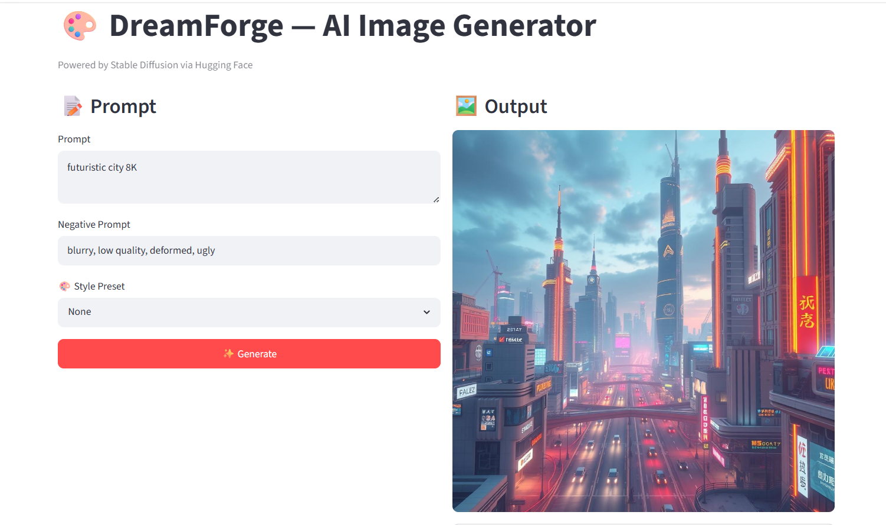
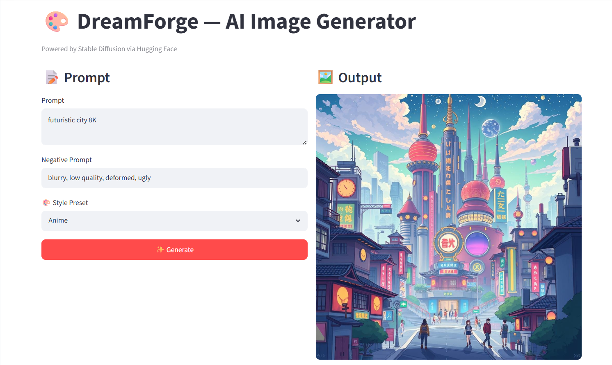
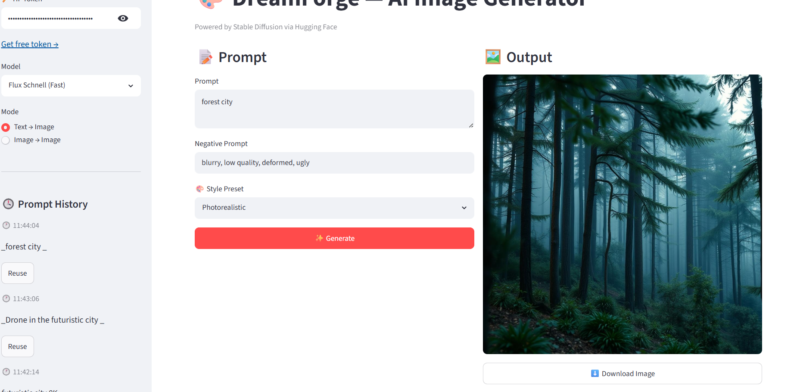

# 🎨 DreamForge AI — Multi-Style Text-to-Image Engine

> Forge stunning high-fidelity images across diverse artistic styles using Stable Diffusion. Deployed live on Hugging Face Spaces.

  
  
  
  

---

## 📸 Style Showcase & Demo

### 🖼️ UI Walkthrough

### 🎨 One Prompt, Multiple Aesthetics
> **Prompt:** *"A futuristic cyberpunk warrior standing in the rain"*

| ⛩️ Anime Style | 📸 Photorealistic |
|:---:|:---:|
|  |  |  

---

## ✨ Key Features

* **⚡ Ultra-Fast Inference** 
* **🎭 Multi-Style Engine** 
* **🛑 Negative Prompt Control** 
* **🕒 Token & Prompt History** 
* **💾 One-Click Export**
* **☁️ Serverless Execution** 

---

## 📊 Live Performance Telemetry

| Metric | Measured Efficiency | 
| :--- | :--- |
| **⏱️ Average Latency** | `6.21 seconds` |
| **🚀 Throughput Speed** | `4.83 iterations/sec` | 

---

## 🛠️ Deep Tech Stack

* **Frontend Interface:** Streamlit (State-managed, low-latency UI components)
* **Generative Core:** Stable Diffusion v1.5 (Latent Diffusion Architecture)
* **Inference Pipeline:** Hugging Face Inference Hub API
* **Language Runtime:** Python 3.10+
* **Environment Configuration:** Streamlit Secret Manager

---

